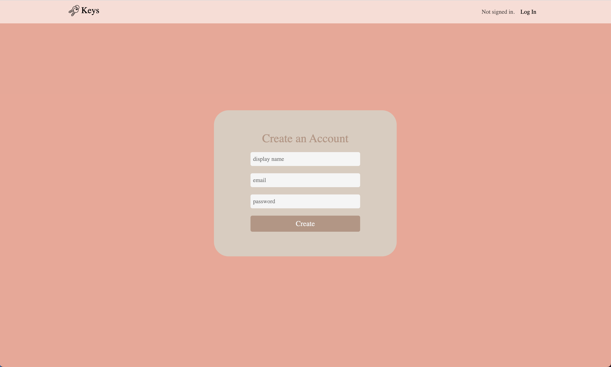
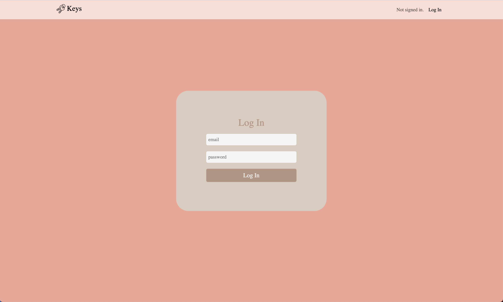
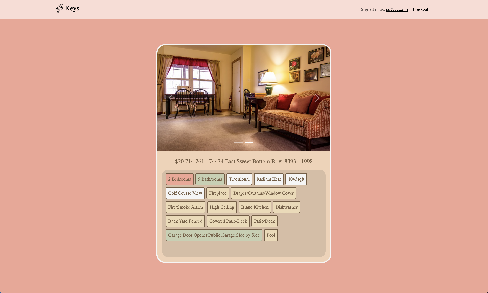
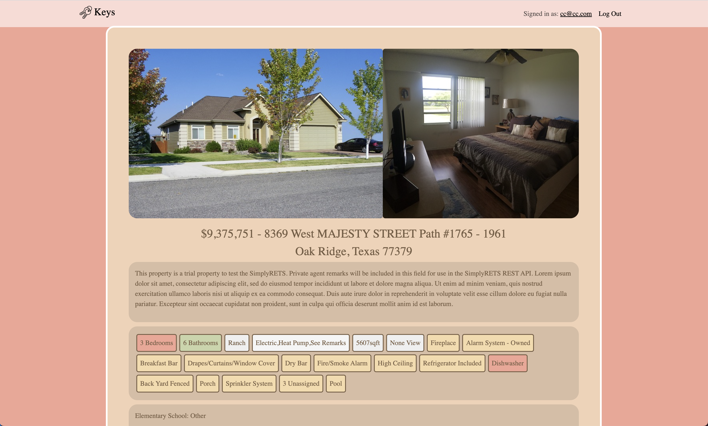
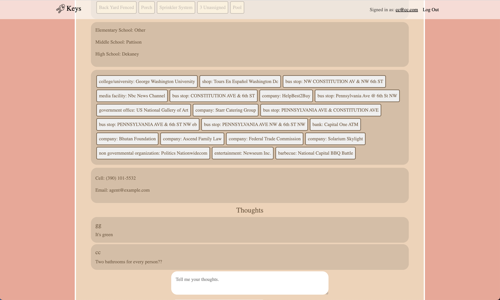
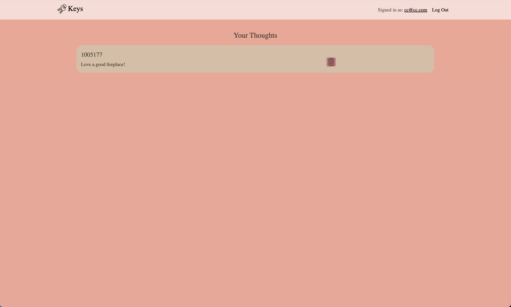

# Keys: A Real Estate App

Welcome to Keys - the real estate app that transforms house hunting into a delightful experience! With Keys, your journey to finding the perfect home is as simple as swiping right.

## Overview

Swipe right on the house for you! Keys tailors the house search to the user and makes home shopping more fun. The app emphasizes user experience and preferences, bringing the familiar swiping mechanic from dating apps to the world of real estate.

## Features

- **Swipe Mechanic:** The main feature of Keys is the intuitive swiping mechanic. Like Tinder, users can swipe right on houses they love and left on those that don't quite match their preferences.

- **Personalized Matches:** Your chosen preferences at the beginning of your Keys journey are used to highlight matches on house cards. See at a glance which houses align with your unique tastes.

- **Liked and Disliked Houses:** Easily review all the houses you've liked and disliked in dedicated sections. Keep track of your favorites and filter out the ones that didn't quite make the cut.

- **House Detail Page:** Dive deeper into each house with a detailed page providing more information. From specifications to neighborhood details, make informed decisions on your potential new home.

- **Nearby Places of Interest:** Utilizing another API call, Keys goes beyond the house itself. Discover nearby places of interest, ensuring the neighborhood aligns with your lifestyle.

- **User Authentication:** Your privacy and security are our top priorities. Keys includes user authentication to ensure a secure and personalized experience.

## Tech Stack

- **Front End:** Developed using Vite and React for a fast and responsive user interface.

- **Back End:** Powered by Django and PostgreSQL for a robust and reliable backend infrastructure.

## Getting Started

To get started with Keys, follow these simple steps:

1. **Sign Up or Log In:** Create an account or log in to start your personalized house hunting journey.

2. **Set Your Preferences:** Tell us about your dream home by setting your preferences. This is the key to unlocking personalized matches.

3. **Swipe Away:** Start swiping! Swipe right on the houses you love and watch as Keys refines its recommendations based on your choices.

4. **Explore Details:** Dive into the details of your liked houses, explore the neighborhood, and make well-informed decisions.

5. **Enjoy the Hunt:** With Keys, home shopping is not just a task, but an enjoyable experience. Swipe right and make your dream home a reality!

Download Keys now and start swiping your way to the home of your dreams!

## Background

This project started as a personal project to put my skills to the test. It's still a work in progress with updates and a reworking of the design coming soon!

## Screenshots

